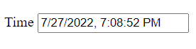

# r-box

r-box is an initiative to create a web component to host your HTML and add reactivity to it.

# Uses
```HTML
<r-box :bind="dataObject">
    <!-- HTML Template-->
</r-box>

<!--data object to bind with r-box-->
<script>
    var dataObject = { };
</script>

<!--add r-box script-->
<script src="src/r-box.js" defer></script>
```

# Directive
r-box has very few directives to add reactivity to HTML
|directive|description|
|---------|-----------|
|data-*| To add reactivity to element attribute use `data-*` directive. For example to add a dynamic class you can use `data-class=methodToReturnClass`| 
|react-on| string representation of list of properties on change of which DOM should adopt the change|

# Interpolation
user `${yourVariableName}` to interpolate the `yourVariableName` in template. E.g.
```
<h1>${title}</h1>
```
Limitation - composite variable interpolation does not work. In case of complex interpolation use function. E.g.
```
<h1>${yourFunctionName}</h1> // yourFunctionName: () => {return var1 + var2 + var3}
```

# data-*
```
<input type="text" data-value="yourVariableName">
```

# Example
```HTML
<r-box :bind="dataObject">

    <label>${label}</label>
    <input type="text" data-value="time">
</r-box>

<script>
    var dataObject = {

        label: 'Time',
        time: ''
    };

    window.setInterval(() => {
        dataObject.time = (new DateTime()).toLocalTime();
    }, 1000);
    
</script>
```
